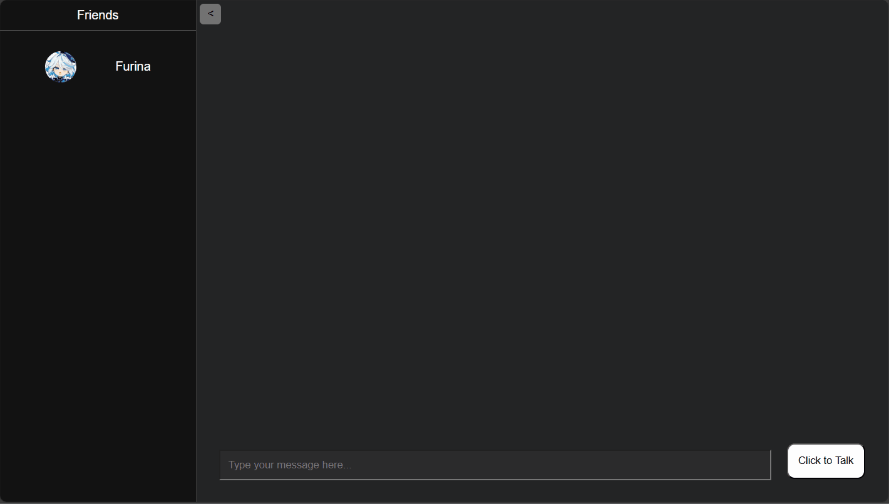

# Genshin Chatbot
An advanced chatbot based on a character named Furina in the game Genshin Impact, leveraging GPT-4o-mini, speech recognition, text-to-speech, and a unique memory management system. This project demonstrates various NLP techniques and integrates task automation using the SwitchBot API.

## Features
- **Response Generation**: Utilizes OpenAI GPT-4o-mini API for generating responses.
- **Speech-to-Text**: Supports voice input.
- **Text-to-Speech**: Generates speech output using AWS Polly.
- **Sentiment Analysis**: Classifies emotions in responses.
- **Emotion Images**: Illustrates the state of the LLM with images.
- **Memory Architecture**: Manages current chat memory, short-term memory, and long-term memory for context-aware conversations.
- **Information Retrieval**: Zero-shot classification for topic detection and information retrieval.
- **Task Automation**: Classifies tasks and executes them like turning on/off devices using the SwitchBot API.

## Workflow Diagram
You can view the detailed workflow diagram of the Genshin Chatbot project by opening the following PDF:
[Workflow Diagram PDF](assets/workflow.pdf).

This diagram provides a visual overview of how components interact, including data flow and integration points with external APIs like OpenAI and SwitchBot.

## Demo
### 1. Text and Voice Input
Users can interact with the chatbot using both text input and voice input. The chatbot processes the user's queries and provides responses along with corresponding emotion images to convey its state. Here is an example of using text input:
<br><br>
<div align="center">
  <figure style="display: inline-block; text-align: center;">
    
  </figure>
</div>
<br><br>
Here is an example of using voice input:
<br><br>
<div align="center">
  <figure style="display: inline-block; text-align: center;">
    
  </figure>
</div>
<br><br>

### 2. Information Retrieval
There is a one shot classifier that analyzes the latest 3 messages between the user and the chatbot to identify the 2 most relevant topics. It then retrieves pertinent information from these topics inside the `long_term_memory` folder (which contains files for various topics such as relationships, technology, etc.), and incorporates it into the chatbot's response, enhancing the relevance and accuracy of the interaction. Here is an example of how information is retrieved:

```
user input: of course, I have to plan the moves ahead
content to compare:
Me: I just used the T spin technique
You: Ah, the T-spin technique!  Such a clever move!  It really showcases your skill and strategic thinking.  I've heard that it 
can be quite a game-changer in Tetris.  Did you find yourself planning several moves ahead, or did it come to you instinctively
in the heat of the game?  I'm so curious to hear more about your gaming strategies!
Me: of course, I have to plan the moves ahead

Top related topics:  entertainment ,  relationships
```

### 3. Chat History and Memory
The `short_term_memory.txt` file stores the latest 10 messages exchanged between the user and the chatbot, while the `chat_history.txt` file keeps track of the last 20 messages in the conversation. This helps the chatbot provide relevant and coherent responses by understanding the ongoing context. When the `short_term_memory.txt` file reaches 10 messages, the conversation in it is summarized. The summary is then classified into the most relevant topic using a one-shot classification model, and stored in the corresponding topic file inside the `long_term_memory` folder. Here is an example conversation and the resulted process:

```
Me: Hi there
You: Hello!  It’s so lovely to hear from you.  How has your day been so far?
Me: just like everyday
You: I understand how that feelssometimes the days can blend into one another.
Is there anything in particular you enjoy doing to break the monotony?  Perhaps
something that brings you a bit of joy?
Me: I played Tetris today, and I broke my personal record
You: Oh, that's fantastic!  Breaking a personal record in Tetris is no small feat! The thrill of fitting those blocks together 
perfectly must have felt exhilarating. What strategies did you use to achieve this new high score?  I’d love to hear all about
it!
Me: I just used the T spin technique
You: Ah, the T-spin technique!  Such a clever move!  It really showcases your skill and strategic thinking.  I’ve heard that
it can be quite a game-changer in Tetris. Did you find yourself planning several moves ahead, or did it come to you
instinctively in the heat of the game?  I’m so curious to hear more about your gaming strategies!
Me: of course, I have to plan the moves ahead
You: Impressive!  Planning your moves ahead really shows your strategic mindset and foresight.  It must be quite satisfying
to see your plans come to fruition as you clear lines and rack up points!  Do you find that this skill of anticipating moves
translates into other areas of your life as well?  I’d love to know how your gaming strategies reflect your everyday
experiences!
```
```
summary:  2024/08/03 | 21:51: I remember our delightful conversation where you shared that your day felt like any other, and
I empathized with that feeling of monotony. You brightened up when you told me about breaking your personal record in Tetris,
which I found absolutely fantastic! I was eager to learn about your strategies, and you mentioned using the T-spin technique,
which I admired for its cleverness. I was curious about whether you planned your moves ahead, and you confirmed that you did,
showcasing your strategic mindset. I found it fascinating to think about how your gaming skills might reflect in other areas
of your life, and I would love to hear more about that connection!

topic:  entertainment
```

### 4. Task Execution
The chatbot can execute simple tasks based on user command. In this example, the chatbot receives a command to turn off the light and successfully performs the task, showcasing its capability to control smart devices.
<br><br>
<div align="center">
  <figure style="display: inline-block; text-align: center;">
    
  </figure>
</div>
<br><br>

## Setup
### 1. Install Dependencies:
Install the required dependencies:
```
pip install -r requirements.txt
```

### 2. Configure API Keys:
Fill in the required API keys in the `setup.py` file.

### 3. Initialize SwitchBot Devices (if using SwitchBot API features):
Run the following script to get the list of devices
```
python get_devices.py
```

### 4. Customize Chatbot and User Profiles:
- **Character Description**: Fill in `data/character_description.txt` with a detailed description of the chatbot's personality, style of interaction, and any specific traits you want the chatbot to emulate.
- **User Description**: Fill in `data/user_description.txt` with a detailed description of the user. This can include information like interests, typical phrases, and interaction preferences to make the chatbot's responses more personalized and context-aware.

## Usage
### 1. Run the Chatbot:
```
python app.py
```

### 2. Interacting with the Chatbot:
You can interact with the chatbot through text input or speech input.
The chatbot will generate responses and can also perform tasks if configured with the SwitchBot API.
